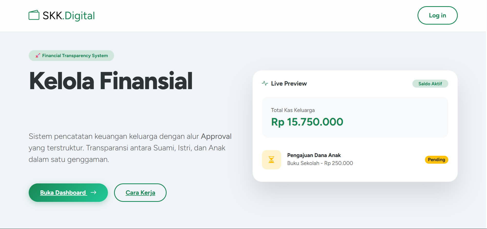
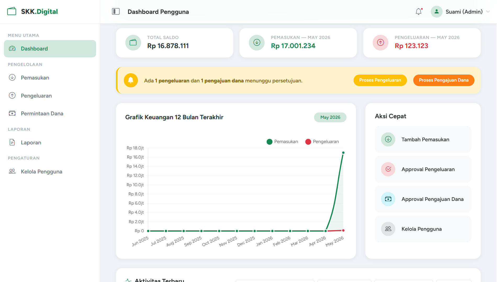
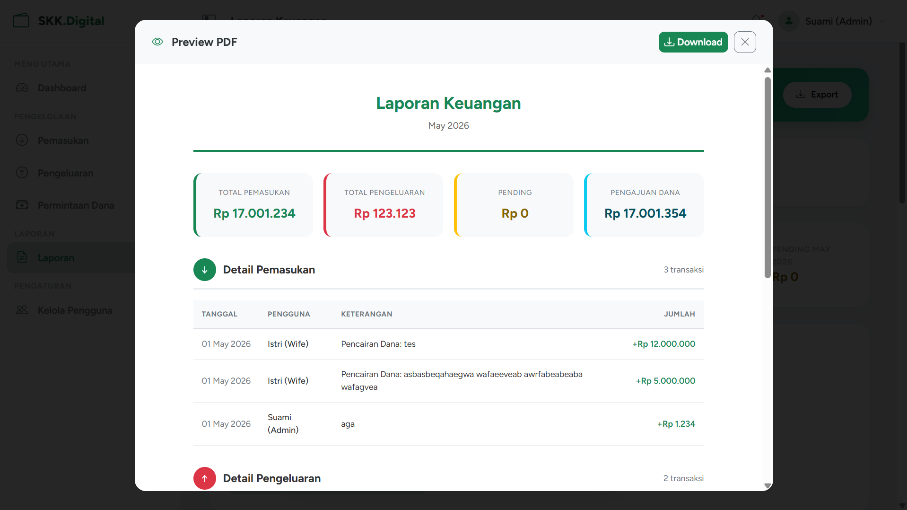
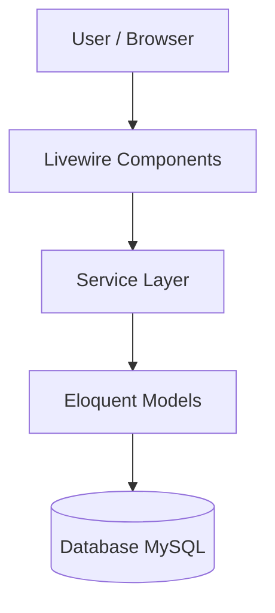
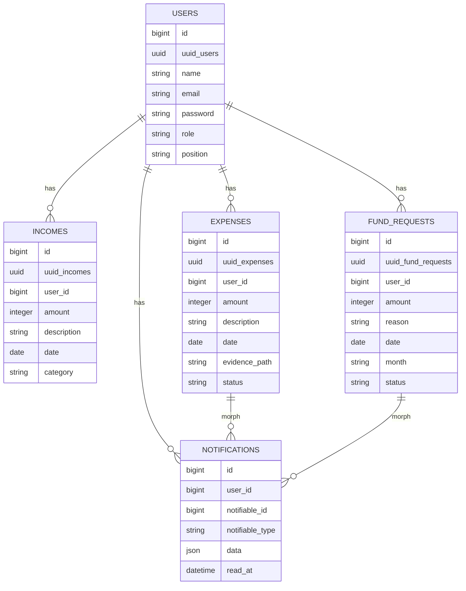

<p align="center">
  
</p>

<h1 align="center">Sistem Keuangan Keluarga</h1>

<p align="center">
  Aplikasi manajemen keuangan keluarga dengan sistem approval workflow.<br>
  <strong>Technical Interview Project - Full Stack Developer</strong><br>
  PT. Niramas Utama (INACO)
</p>

<p align="center">
  
  
  
  
</p>

---

## About

Sistem Keuangan Keluarga adalah aplikasi berbasis Laravel yang digunakan untuk mengelola pemasukan, pengeluaran, serta pengajuan dana dalam lingkup keluarga secara terstruktur dan transparan.

Aplikasi ini menerapkan:

- Role-Based Access Control (RBAC)
- Approval workflow antara Admin dan User
- Pemisahan business logic menggunakan service layer
- Livewire class-based components untuk interaktivitas

---

## Features

- Role-Based Access Control menggunakan Laravel Policy
- Approval workflow (approve / reject)
- Otomatisasi pemasukan dari pengajuan dana yang disetujui
- Upload bukti transaksi (gambar dan PDF)
- Export laporan ke PDF dan Excel
- Validasi form dan proteksi data
- Antarmuka responsif berbasis Bootstrap

---

## Preview

### Welcome Page

<p align="center">
  
</p>

### Dashboard

<p align="center">
  
</p>

### PDF Preview (Modal)

<p align="center">
  
</p>

---

## Tech Stack

| Category       | Technology            |
| -------------- | --------------------- |
| Framework      | Laravel 13            |
| Language       | PHP 8.3               |
| Database       | MySQL                 |
| Frontend       | Blade + Bootstrap 5   |
| Interactivity  | Livewire 3            |
| Authentication | Laravel Breeze        |
| Export         | DomPDF, Laravel Excel |

---

## Architecture



Aplikasi ini menggunakan arsitektur berbasis layer untuk menjaga kode tetap terstruktur dan mudah dikembangkan:

- **Livewire Components** untuk tampilan dan interaksi user
- **Service Layer** untuk logika bisnis
- **Models (Eloquent)** untuk pengolahan data
- **Database** sebagai penyimpanan

---

## 🧩 ERD (Entity Relationship Diagram)



---

### 🔗 Relasi Antar Tabel

- 1 User bisa punya banyak:
    - Income (Pemasukan)
    - Expense (Pengeluaran)
    - Fund Request (Pengajuan Dana)
    - Notification

- Notification menggunakan **polymorphic relation**, artinya:
    - Bisa berasal dari Expense
    - Bisa juga dari Fund Request

Contoh:

- Saat expense di-approve → buat notification
- Saat fund request di-reject → buat notification

---

### 💡 Design Notes

- Menggunakan UUID untuk meningkatkan keamanan (URL tidak mudah ditebak)
- Menggunakan polymorphic relationship untuk fleksibilitas sistem notifikasi
- Struktur relasi dibuat sederhana agar mudah dikembangkan (scalable)

---

## Why This Approach

Pendekatan ini digunakan agar kode tetap rapi dan mudah dikembangkan.

### Service Layer

- Memisahkan logika bisnis dari tampilan
- Menghindari duplikasi kode
- Mempermudah maintenance

### Livewire

- Mengurangi kebutuhan JavaScript
- Lebih cepat dikembangkan dalam ekosistem Laravel
- Cocok untuk dashboard dan form

### Laravel Policy (RBAC)

- Mengatur hak akses secara terpusat
- Membuat sistem lebih aman dan terstruktur

### Separation of Concerns

- UI → Livewire
- Logic → Service
- Data → Model

Dengan pemisahan ini, aplikasi lebih mudah dipahami dan dikembangkan.

---

## Application Flow

1. User membuat pengajuan dana atau mencatat pengeluaran
2. Status transaksi menjadi `pending`
3. Admin melakukan approval atau penolakan
4. Data yang disetujui masuk ke pemasukan
5. Semua transaksi tersimpan dengan bukti

---

## Installation

### Clone Repository

```bash
git clone [repository-url]
cd sistem-keuangan-keluarga
```

### Install Dependencies

```bash
composer install
npm install && npm run build
```

### Install Additional Packages

```bash
composer require barryvdh/laravel-dompdf
composer require maatwebsite/excel
```

### Setup Environment

```bash
cp .env.example .env
```

Edit konfigurasi database:

```env
DB_CONNECTION=mysql
DB_HOST=127.0.0.1
DB_PORT=3306
DB_DATABASE=sistem_keuangan_keluarga
DB_USERNAME=root
DB_PASSWORD=
```

### Generate Key

```bash
php artisan key:generate
```

### Migration and Seeder

```bash
php artisan migrate --seed
```

### Storage Link

```bash
php artisan storage:link
```

### Run Application

```bash
php artisan serve
```

---

## Demo Accounts

| Role  | Position | Email            | Password    |
| ----- | -------- | ---------------- | ----------- |
| Admin | Husband  | admin@gmail.com  | password123 |
| User  | Wife     | wif@gmail.com    | password123 |
| User  | Child    | child1@gmail.com | password123 |
| User  | Child    | child2@gmail.com | password123 |

---

## Access Control

**Admin**

- Full system access
- Approval pengajuan dana
- Akses laporan

**User**

- Membuat pengajuan dana
- Mencatat pengeluaran
- Menunggu approval

---

## Project Structure

```bash
app/
├── Exports/
├── Http/
│   ├── Controllers/
│   └── Middleware/
├── Livewire/
│   ├── Auth/
│   ├── Dashboard/
│   ├── Expenses/
│   ├── FundRequests/
│   ├── Income/
│   ├── Layout/
│   ├── Profile/
│   ├── Reports/
│   ├── Statistics/
│   └── Users/
├── Models/
├── Policies/
├── Providers/
└── Services/
    ├── DashboardService.php
    ├── ExpenseService.php
    ├── FundRequestService.php
    ├── IncomeService.php
    ├── NotificationService.php
    ├── ProfileService.php
    ├── ReportService.php
    ├── ReportExportService.php
    └── UserService.php

public/
├── build/
├── css/
└── index.php

resources/
├── views/
│   ├── exports/
│   ├── livewire/
│   │   ├── auth/
│   │   ├── dashboard/
│   │   ├── expenses/
│   │   ├── fund-requests/
│   │   ├── income/
│   │   ├── layout/
│   │   ├── profile/
│   │   ├── reports/
│   │   ├── statistics/
│   │   ├── users/
│   │   └── welcome/
│   └── welcome.blade.php
└── css/

routes/
└── web.php

storage/
└── app/public/evidence/
```

---

## Notes

- Jalankan `php artisan storage:link` untuk akses file upload
- Export laporan tersedia dalam format PDF dan Excel
- Livewire digunakan untuk interaksi tanpa reload halaman

---

## Future Improvements

- Notifikasi real-time (WebSocket)
- Multi-family support (multi tenant)
- Audit log untuk tracking aktivitas pengguna
- REST API untuk integrasi mobile apps
- Peningkatan UI/UX dan mobile responsiveness

---

## Documentation

Dokumentasi lengkap dapat diakses pada:

- [Lihat Dokumentasi](https://docs.google.com/document/d/11gR_FC7OXHbdOK9MwvOHtbLB0f3B0ATUUw0gLRUDOWE/edit?usp=sharing)

---

## Disclaimer

Project ini dikembangkan dengan bantuan AI sebagai alat pendukung untuk eksplorasi solusi, perbaikan kode, dan penyusunan dokumentasi.  
Seluruh implementasi dan keputusan teknis tetap dilakukan secara mandiri.

---

## License

Project ini dibuat untuk kebutuhan technical test dan pembelajaran.
